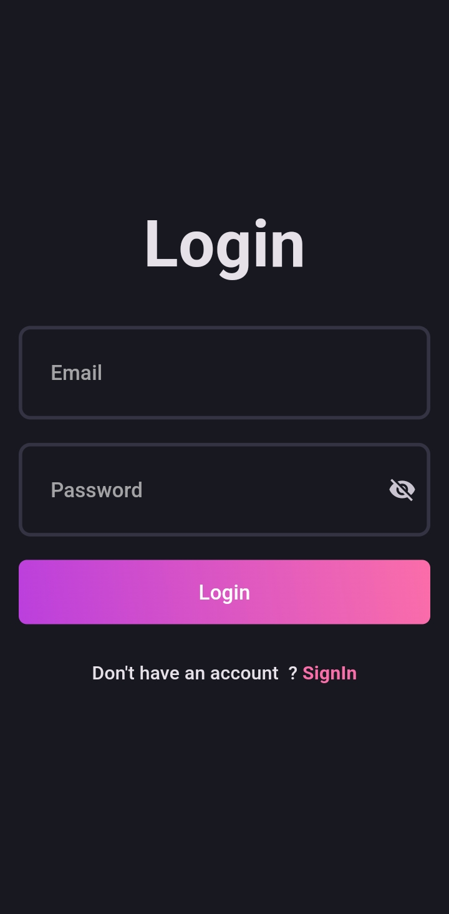

# Multi Player TicTacToe Game

A feature-rich blog app built with Flutter, leveraging Supabase for authentication, storage, and email verification.

## Features

- User authentication and registration
- Create, read, update, and delete blog posts
- Upload and manage cover images for blog posts
- Email verification for account security
- Clean and intuitive user interface

## Running the app

Clone the repository

```
git clone https://github.com/withmohitjoshi/blog_app.git
```

Navigate to the directory

```
cd ./blog_app
```

Install required packages

```
flutter pub get
```

Run the App

You need to create a <b>.env</b> in root folder and place variables<br />
<b>SUPABASE_URL="YOUR_SUPABASE_URL"</b><br/>
<b>SUPABASE_KEY="YOUR_SUPABASE_KEY"</b>

Run the app

```
flutter run
```

## Snapshots




